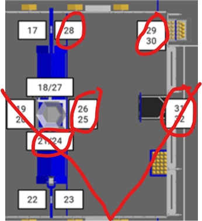

# GC Optimizations for Loop Overrun Prevention

This document describes optimizations made to reduce garbage collection (GC) pressure during robot operation, particularly during autonomous routines.

## Background

The RoboRIO has limited memory (~256MB) and uses a constrained JVM heap (100MB by default). When Java's garbage collector runs, it pauses code execution. During a match, these pauses can cause loop overruns - where the 20ms periodic cycle takes longer than expected, causing timing issues in path following and other time-critical operations.

## Problem Patterns

The following patterns were identified as sources of frequent object allocation in hot paths (code running at 50Hz):

1. **Collection allocation in loops** - Creating `new ArrayList<>()` every periodic cycle
2. **Stream operations** - `Arrays.stream().min()` creates intermediate objects
3. **String concatenation** - `PREFIX + "suffix"` creates new String objects
4. **Array allocation in callbacks** - `list.toArray(new Type[0])` allocates every call
5. **Repeated method calls** - Calling `getStateCopy()` multiple times when once suffices

## Changes Made

### Vision.java

| Issue                            | Fix                                                    |
| -------------------------------- | ------------------------------------------------------ |
| `new ArrayList<>()` in periodic  | Pre-allocated as class field, use `clear()` each cycle |
| `Arrays.stream(distances).min()` | Replaced with simple for-loop                          |
| `"Limelight: " + key` in loop    | Pre-computed keys in Map during construction           |

### VisionIOLimelight.java

| Issue                                                   | Fix                                                  |
| ------------------------------------------------------- | ---------------------------------------------------- |
| `new int[]`, `new double[]`, `new Pose3d[]` every cycle | Pre-allocated arrays as instance fields (max size 8) |

Three arrays were allocated every periodic cycle (50Hz) when tags were visible, creating up to 150 array allocations per second per Limelight. Fixed by pre-allocating arrays with a fixed max size of 12 fiducials (a camera with an 80 degree FOV could see at least 9 tags in this game). The actual count is tracked via `inputs.fiducialCount`.



### RobotContainer.java

| Issue                                                  | Fix                                                           |
| ------------------------------------------------------ | ------------------------------------------------------------- |
| `poses.toArray(new Pose2d[0])` in PathPlanner callback | Reusable array field, reallocates only when path size changes |

### CommandSwerveDrivetrain.java

| Issue                                            | Fix                                          |
| ------------------------------------------------ | -------------------------------------------- |
| `CMD_NAME + " Current Pose"` (4x per cycle)      | Static final String constants                |
| `getStateCopy()` called multiple times per cycle | Cached state pattern with `getCachedState()` |

#### Cached State Pattern

The `getStateCopy()` method allocates a new `SwerveDriveState` object each call. Previously this was called:

- 4x in `periodic()` for logging
- 2x in PathPlanner suppliers (pose + speeds) during auto

**Solution:** Cache the state once per cycle and expose via `getCachedState()`:

```java
private SwerveDriveState cachedState;

public SwerveDriveState getCachedState() {
    if (cachedState == null) {
        cachedState = this.getStateCopy();
    }
    return cachedState;
}

@Override
public void periodic() {
    cachedState = this.getStateCopy();  // Refresh once per cycle
    Logger.recordOutput(LOG_CURRENT_POSE, cachedState.Pose);
    // ... rest of logging uses cachedState
}
```

PathPlanner's AutoBuilder is configured to use `getCachedState()`:

```java
AutoBuilder.configure(
    () -> getCachedState().Pose,   // Pose supplier
    this::resetPose,
    () -> getCachedState().Speeds, // Speeds supplier
    // ...
);
```

#### Why This Works: Command Scheduler Execution Order

Per [WPILib Command Scheduler docs](https://docs.wpilib.org/en/stable/docs/software/commandbased/command-scheduler.html), the scheduler runs in this order each cycle:

1. **Subsystem `periodic()` methods** run first
2. Triggers are polled to schedule new commands
3. **Command `execute()` methods** run (including PathPlanner path following)
4. Default commands are scheduled

This guarantees `cachedState` is refreshed in `periodic()` before PathPlanner queries it in `execute()`. The cache is always current for the scheduler cycle.

## Not Modified

**LimelightHelpers.java** - This vendor library allocates Pose2d/Translation2d/Rotation2d objects in `toPose2D()`. Modifying vendor files is not recommended as updates would overwrite changes. If this becomes a bottleneck, consider forking the file or requesting an upstream optimization.

## Guidelines for Future Code

To avoid GC pressure in periodic/execute methods:

```java
// BAD - allocates every cycle
List<Thing> items = new ArrayList<>();
Logger.recordOutput(PREFIX + "key", value);
double min = Arrays.stream(arr).min().orElse(0);

// GOOD - reuse allocations
private final List<Thing> items = new ArrayList<>();  // field
private static final String LOG_KEY = "Prefix/key";   // constant

// In periodic:
items.clear();  // reuse list
Logger.recordOutput(LOG_KEY, value);
double min = Double.MAX_VALUE;  // simple loop
for (double v : arr) if (v < min) min = v;
```

## Related Configuration

JVM arguments in `build.gradle` (lines 116-124) control GC behavior:

- `-XX:+UseSerialGC` - Single-threaded collector for predictability
- `-Xmx100M -Xms100M` - Fixed heap size prevents resize pauses
- `-XX:+AlwaysPreTouch` - Pre-allocates memory at startup
