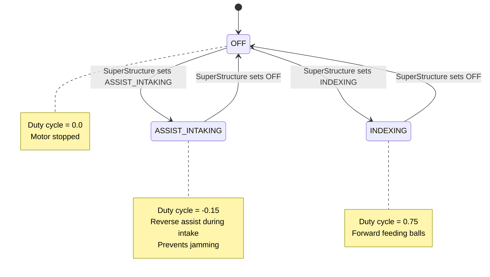
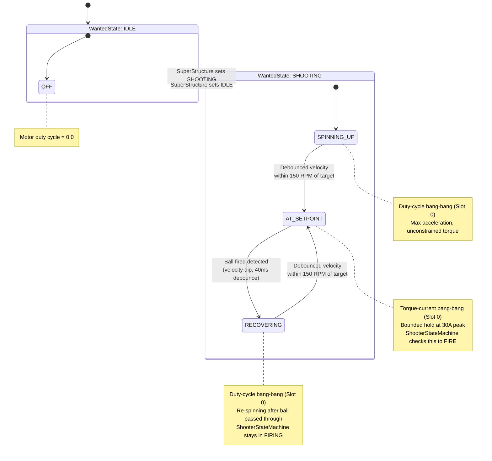

# State Machine Diagram Guide

This document defines the standard pattern for creating state machine diagrams in the RainMaker26 codebase. All state machine diagrams should follow these conventions for consistency and clarity.

---

## Table of Contents

1. [Diagram Types](#diagram-types)
2. [Pattern Overview](#pattern-overview)
3. [Subsystem State Diagrams](#subsystem-state-diagrams)
4. [Coordinator State Machine Diagrams](#coordinator-state-machine-diagrams)
5. [Visual Elements](#visual-elements)
6. [File Organization](#file-organization)
7. [Template Examples](#template-examples)

---

## Diagram Types

### Type 1: Simple Subsystem State Diagram
**Used for:** Subsystems with no internal states (wanted state = current state)

**Examples:** Indexer, HopperRoller, IntakePivot

**Characteristics:**
- Single flat state machine
- All states are wanted states
- Simple transitions between discrete behaviors
- Each state maps to a direct hardware output

### Type 2: Complex Subsystem State Diagram
**Used for:** Subsystems with multi-phase behaviors and internal state tracking

**Examples:** Flywheel, Hood, Intake

**Characteristics:**
- Composite states showing wanted state containers
- Internal states within each wanted state container
- Sensor-based transitions between internal states
- Complex execution phases (spinning up → at setpoint → recovering)

### Type 3: Coordinator State Machine Diagram
**Used for:** High-level coordination layers (SuperStructure, ShooterStateMachine, TargetSelectionStateMachine)

**Examples:** SuperStructure, ShooterStateMachine, TargetSelectionStateMachine

**Characteristics:**
- Shows wanted states as composite containers
- Internal states within wanted state containers
- External transitions between wanted states (via `setWantedState()`)
- Internal transitions within wanted states (conditional logic)
- References to subsystem states affected by each coordinator state

---

## Pattern Overview

### Key Principles

1. **Wanted States as Containers** - Each `WantedState` enum value gets its own composite state box
2. **Internal States Inside Containers** - Show internal state transitions within the wanted state container
3. **Clear Transition Labels** - Label what triggers each transition (sensor conditions, method calls, button presses)
4. **Detailed Notes** - Each state has a note explaining:
   - What subsystems are controlled
   - What hardware outputs are set
   - What sensors/conditions gate transitions
   - Special behaviors or edge cases

### Visual Hierarchy

```
┌─────────────────────────────────────────┐
│ WantedState: SHOOTING                   │  ← Composite state container
│                                         │
│  ┌──────────────────┐                  │
│  │ SPINNING_UP      │  ← Internal state │
│  └──────────────────┘                  │
│           ↓                             │
│  ┌──────────────────┐                  │
│  │ AT_SETPOINT      │  ← Internal state │
│  └──────────────────┘                  │
│           ↓                             │
│  ┌──────────────────┐                  │
│  │ RECOVERING       │  ← Internal state │
│  └──────────────────┘                  │
│                                         │
│  [Notes describing behavior]           │
└─────────────────────────────────────────┘
```

---

## Subsystem State Diagrams

### Simple Subsystem Pattern (No Internal States)

**Template:**


```mermaid
---
title: <Subsystem> State Machine
---
stateDiagram-v2
    direction TB
    [*] --> OFF

    %% State transitions
    OFF --> <STATE_1> : SuperStructure sets <STATE_1>
    <STATE_1> --> OFF : SuperStructure sets OFF
    OFF --> <STATE_2> : SuperStructure sets <STATE_2>
    <STATE_2> --> OFF : SuperStructure sets OFF
    <STATE_1> --> <STATE_2> : SuperStructure sets <STATE_2>
    <STATE_2> --> <STATE_1> : SuperStructure sets <STATE_1>

    %% Notes for each state
    note right of OFF
        <Hardware outputs when OFF>
        <What motors/actuators are doing>
    end note

    note right of <STATE_1>
        <Hardware outputs for STATE_1>
        <Motor duty cycles, positions, etc.>
        <Special behaviors>
    end note

    note right of <STATE_2>
        <Hardware outputs for STATE_2>
        <Motor duty cycles, positions, etc.>
        <Special behaviors>
    end note
```

**Example (Indexer):**


**Checklist:**
- [ ] All wanted states shown as top-level states
- [ ] Transitions labeled with "SuperStructure sets <STATE>"
- [ ] Each state has a note with:
  - [ ] Hardware output values (duty cycle, position, velocity)
  - [ ] Purpose/behavior description
- [ ] Default/initial state marked with `[*] -->`
- [ ] Direction set to `TB` (top-to-bottom)

---

### Complex Subsystem Pattern (With Internal States)

**Template:**


```mermaid
---
title: <Subsystem> State Machine
---
stateDiagram-v2
    direction TB

    %% Wanted state containers
    state "WantedState: <WANTED_1>" as WANTED_1_CONTAINER {
        [*] --> <Internal_State_A>
        <Internal_State_A>: <INTERNAL_STATE_NAME>
        
        note right of <Internal_State_A>
            <Hardware behavior>
            <Control mode/slot>
            <What this phase does>
        end note
    }

    state "WantedState: <WANTED_2>" as WANTED_2_CONTAINER {
        [*] --> <Internal_State_B>
        <Internal_State_B> --> <Internal_State_C> : <Sensor condition>
        <Internal_State_C> --> <Internal_State_B> : <Sensor condition>
        
        <Internal_State_B>: <INTERNAL_STATE_NAME_B>
        <Internal_State_C>: <INTERNAL_STATE_NAME_C>
        
        note right of <Internal_State_B>
            <Hardware behavior for state B>
            <Control details>
        end note
        
        note right of <Internal_State_C>
            <Hardware behavior for state C>
            <Control details>
        end note
    }

    %% Transitions between wanted states
    [*] --> WANTED_1_CONTAINER
    WANTED_1_CONTAINER --> WANTED_2_CONTAINER : SuperStructure sets <WANTED_2>
    WANTED_2_CONTAINER --> WANTED_1_CONTAINER : SuperStructure sets <WANTED_1>
```

**Example (Flywheel):**


**Checklist:**
- [ ] Each wanted state is a composite state container
- [ ] Container labeled as "WantedState: <NAME>"
- [ ] Internal states defined within container with descriptions
- [ ] Initial internal state marked with `[*] -->` inside container
- [ ] Internal transitions labeled with sensor/condition triggers
- [ ] External transitions labeled with "SuperStructure sets <STATE>"
- [ ] Each internal state has a note with:
  - [ ] Control mode/slot information
  - [ ] Hardware behavior (duty cycle, position, velocity control)
  - [ ] Special conditions or coordination notes
  - [ ] Debouncing/timing information if applicable
- [ ] Direction set to `TB`

---

## Coordinator State Machine Diagrams

### SuperStructure Pattern

**Template:**


```mermaid
---
title: <Coordinator> State Machine
---
stateDiagram-v2
    direction TB

    %% Wanted state containers
    state "WantedState: <WANTED_STATE_1>" as WANTED_1 {
        [*] --> <InternalState1>
        <InternalState1>: <INTERNAL_STATE_NAME>
        
        note right of <InternalState1>
            Subsystem1 → <State>
            Subsystem2 → <State>
            Subsystem3 → <State>
            <Special behavior notes>
        end note
    }

    state "WantedState: <WANTED_STATE_2>" as WANTED_2 {
        [*] --> <InternalStateA>
        <InternalStateA> --> <InternalStateB> : <Condition>
        
        <InternalStateA>: <INTERNAL_STATE_A>
        <InternalStateB>: <INTERNAL_STATE_B>
        
        note right of <InternalStateA>
            Subsystem1 → <State>
            Subsystem2 → <State>
            <Coordination logic>
        end note
        
        note right of <InternalStateB>
            Subsystem1 → <State>
            Subsystem2 → <State>
            <Coordination logic>
        end note
    }

    %% External transitions
    [*] --> WANTED_1
    WANTED_1 --> WANTED_2 : <Trigger (button, command, etc.)>
    WANTED_2 --> WANTED_1 : <Trigger>
```

**Key Elements:**
1. **Wanted State Containers** - Each `SuperWantedStates` enum value
2. **Internal State Mapping** - Show which `SuperInternalStates` apply
3. **Subsystem State Notes** - List what state each subsystem is set to
4. **Trigger Labels** - What causes transitions (driver input, sensor, etc.)

**Example Structure:**
```mermaid
state "WantedState: SHOOT_AT_HUB" as SHOOTING_HUB {
    [*] --> SHOOTING_AT_HUB
    SHOOTING_AT_HUB: SHOOTING_AT_HUB (internal state)
    
    note right of SHOOTING_AT_HUB
        TargetSelection → HUB
        ShooterStateMachine → SHOOTING
          ↳ Contains: PREPARING_TO_FIRE ↔ FIRING
        Intake → OFF
        Indexer → OFF (until FIRING)
        IntakePivot → OFF
        HopperRoller → OFF (until FIRING)
        
        When ShooterStateMachine reaches FIRING:
          Indexer → INDEXING
          HopperRoller → ROLLING
          IntakePivot → AGITATE_HOPPER
          Intake → ASSIST_SHOOTING
    end note
}
```

**Checklist:**
- [ ] Each wanted state is a composite container
- [ ] Shows mapping to internal state(s)
- [ ] Lists all subsystem states affected
- [ ] Shows nested state machines (ShooterStateMachine, TargetSelection)
- [ ] Documents conditional subsystem state changes
- [ ] External transitions show triggers (button presses, commands)
- [ ] Notes explain coordination logic
- [ ] Direction set to `TB`

---

### ShooterStateMachine / TargetSelectionStateMachine Pattern

Similar to complex subsystem pattern, but emphasizes:
- Wanted states as containers
- Internal state transitions based on subsystem readiness
- References to subsystem states being checked

**Example (ShooterStateMachine):**
```mermaid
state "WantedState: SHOOTING" as SHOOTING_WANTED {
    [*] --> StatePreparingToFire
    StatePreparingToFire: PREPARING_TO_FIRE
    StateFiring: FIRING

    StatePreparingToFire --> StateFiring : Flywheel AT_SETPOINT<br>AND Hood AT_SETPOINT<br>AND drivetrain aligned<br>AND target shootable
    StateFiring --> StatePreparingToFire : Flywheel UNDER_SHOOTING<br>OR hood loses position<br>OR alignment lost

    note right of StatePreparingToFire
        Spinning up and aiming
        Flywheel → SHOOTING (ramping up)
        Hood → AIMING (moving to angle)
        FlywheelKicker → KICKING
    end note
    
    note right of StateFiring
        Ready and firing
        Flywheel → SHOOTING (at setpoint)
        Hood → AIMING (at setpoint)
        FlywheelKicker → KICKING
        Stays in FIRING through brief RPM dips
    end note
}
```

**Checklist:**
- [ ] Wanted states as containers
- [ ] Internal states with clear phase names
- [ ] Transition conditions reference subsystem internal states
- [ ] Notes show what subsystem states are set
- [ ] Coordination logic explained (what gates transitions)

---

## Visual Elements

### Required Components

1. **Title Block**
```mermaid
---
title: <Subsystem/Coordinator> State Machine
---
```

2. **Direction Directive**
```mermaid
stateDiagram-v2
    direction TB
```

3. **Composite State Syntax**
```mermaid
state "WantedState: <NAME>" as <CONTAINER_ID> {
    [*] --> <InitialState>
    <State1>: <STATE_NAME>
    <State1> --> <State2> : <condition>
}
```

4. **Notes with Multi-line Content**
```mermaid
note right of <StateName>
    Line 1: Hardware outputs
    Line 2: Control mode
    Line 3: Special behavior
end note
```

5. **Transition Labels**
```mermaid
StateA --> StateB : Clear description<br>Multi-line if needed
```

### Naming Conventions

**State Container IDs:**
- Format: `<WANTED_STATE_NAME>_WANTED` or `<WANTED_STATE_NAME>_CONTAINER`
- Examples: `SHOOTING_WANTED`, `IDLE_CONTAINER`, `AUTO_WANTED`

**Internal State IDs:**
- Format: `State<PascalCaseName>`
- Examples: `StateAtSetpoint`, `StatePreparingToFire`, `StateSpinningUp`

**State Descriptions:**
- Format: `<STATE_NAME>: <ENUM_VALUE>`
- Examples: `StateAtSetpoint: AT_SETPOINT`, `StateFiring: FIRING`

### Positioning Notes

- **Simple diagrams**: `note right of <State>`
- **Complex diagrams**: `note right of <State>` (keeps notes with their states inside containers)
- **Avoid `note left`** unless necessary for layout (right is more readable)

---

## File Organization

### Directory Structure

```
docs/
  diagrams/
    SuperStructureStateMachine.mmd          ← Top-level coordinator
    state_machines/                         ← Mid-level coordinators
      ShootingStateMachine.mmd
      TargetSelectionStateMachine.mmd
    subsystem_states/                       ← Individual subsystems
      FlywheelStateMachine.mmd
      IndexerStateMachine.mmd
      HoodStateMachine.mmd
      IntakeStateMachine.mmd
      IntakePivotStateMachine.mmd
      HopperRollerStateMachine.mmd
      FlywheelKickerStateMachine.mmd
```

### Naming Convention

- **File name**: `<SubsystemOrCoordinator>StateMachine.mmd`
- **Title**: `<Subsystem/Coordinator> State Machine` (with space, no "StateMachine" in title)

---

## Template Examples

### Template 1: Simple Subsystem (No Internal States)

```mermaid
---
title: <Subsystem> State Machine
---
stateDiagram-v2
    direction TB
    [*] --> OFF

    OFF --> STATE_1 : SuperStructure sets STATE_1
    STATE_1 --> OFF : SuperStructure sets OFF
    OFF --> STATE_2 : SuperStructure sets STATE_2
    STATE_2 --> OFF : SuperStructure sets OFF
    STATE_1 --> STATE_2 : SuperStructure sets STATE_2
    STATE_2 --> STATE_1 : SuperStructure sets STATE_1

    note right of OFF
        <Hardware behavior when off>
        Example: Duty cycle = 0.0
    end note

    note right of STATE_1
        <Hardware behavior for state 1>
        Example: Duty cycle = 0.75
        Example: Position = 45.0 degrees
    end note

    note right of STATE_2
        <Hardware behavior for state 2>
        Example: Duty cycle = -0.35
    end note
```



### Template 2: Complex Subsystem (With Internal States)

```mermaid
---
title: <Subsystem> State Machine
---
stateDiagram-v2
    direction TB

    state "WantedState: IDLE" as IDLE_WANTED {
        [*] --> StateOff
        StateOff: OFF
        note right of StateOff
            Motor stopped
            Output = 0.0
        end note
    }

    state "WantedState: ACTIVE" as ACTIVE_WANTED {
        [*] --> StateMoving
        StateMoving --> StateAtTarget : Sensor reaches target<br>(debounced 100ms)
        StateAtTarget --> StateMoving : Target changed<br>OR position error > tolerance
        
        StateMoving: MOVING_TO_SETPOINT
        StateAtTarget: AT_SETPOINT
        
        note right of StateMoving
            <Control mode>
            <Hardware behavior>
        end note
        
        note right of StateAtTarget
            <Control mode>
            <Hardware behavior>
            <Who checks this state>
        end note
    }

    [*] --> IDLE_WANTED
    IDLE_WANTED --> ACTIVE_WANTED : SuperStructure sets ACTIVE
    ACTIVE_WANTED --> IDLE_WANTED : SuperStructure sets IDLE
```



### Template 3: Coordinator State Machine

```mermaid
---
title: <Coordinator> State Machine
---
stateDiagram-v2
    direction TB

    state "WantedState: <WANTED_1>" as WANTED_1 {
        [*] --> StateInternal1
        StateInternal1: <INTERNAL_STATE_1>
        
        note right of StateInternal1
            Subsystem1 → <State>
            Subsystem2 → <State>
            SubsystemN → <State>
            
            <Coordination notes>
        end note
    }

    state "WantedState: <WANTED_2>" as WANTED_2 {
        [*] --> StateInternalA
        StateInternalA --> StateInternalB : <Condition>
        StateInternalB --> StateInternalA : <Condition>
        
        StateInternalA: <INTERNAL_STATE_A>
        StateInternalB: <INTERNAL_STATE_B>
        
        note right of StateInternalA
            Subsystem1 → <State>
            Subsystem2 → <State>
        end note
        
        note right of StateInternalB
            Subsystem1 → <State>
            Subsystem2 → <State>
        end note
    }

    [*] --> WANTED_1
    WANTED_1 --> WANTED_2 : <Trigger>
    WANTED_2 --> WANTED_1 : <Trigger>
```



---

## Summary Checklist

### Before Creating a Diagram

- [ ] Identify diagram type (simple subsystem, complex subsystem, coordinator)
- [ ] Review the corresponding Java class
- [ ] List all wanted state enum values
- [ ] List all internal state enum values (if applicable)
- [ ] Identify what triggers transitions
- [ ] Note what hardware is controlled in each state

### While Creating the Diagram

- [ ] Use correct template for diagram type
- [ ] Add `direction TB` directive
- [ ] Create composite states for wanted states
- [ ] Define internal states within containers
- [ ] Add transition labels with conditions
- [ ] Write detailed notes for each state
- [ ] Use consistent naming (WantedState: X, State<Name>: ENUM_VALUE)

### After Creating the Diagram

- [ ] Validate syntax with mermaid-diagram-validator tool
- [ ] Preview with mermaid-diagram-preview tool
- [ ] Verify all states from code are represented
- [ ] Verify all transitions from code are shown
- [ ] Check that notes match actual behavior in code
- [ ] Ensure file is in correct directory
- [ ] Ensure filename follows convention

---

## Example: Full SuperStructure State Notes

For each SuperStructure wanted state, the note should include:

```mermaid
note right of State<Name>
    TargetSelection → <STATE>
    ShooterStateMachine → <WANTED_STATE>
      ↳ Internal states: <STATE_1> ↔ <STATE_2>
    Intake → <STATE>
    Indexer → <STATE>
    IntakePivot → <STATE>
    HopperRoller → <STATE>
    Flywheel → <STATE> (via ShooterStateMachine)
    Hood → <STATE> (via ShooterStateMachine)
    FlywheelKicker → <STATE> (via ShooterStateMachine)
    
    Conditional changes:
      When <condition>:
        Subsystem → <NEW_STATE>
      When <condition>:
        Subsystem → <NEW_STATE>
    
    Special behaviors:
      - <Note about coordination>
      - <Note about timing>
end note
```

This ensures complete documentation of the coordination logic in a visual format.
